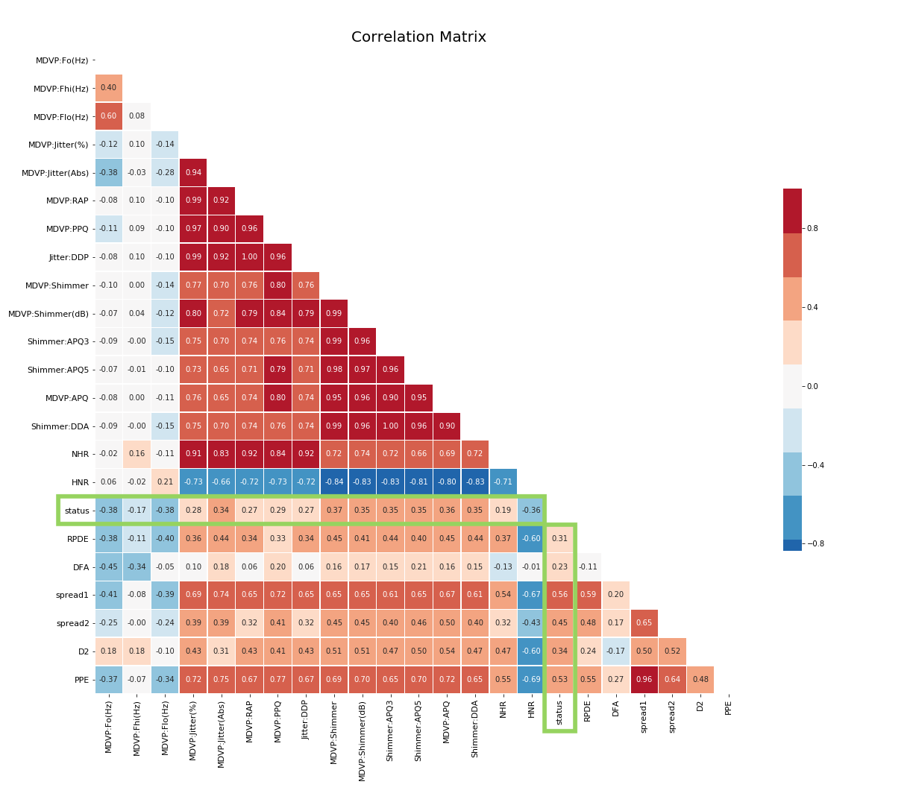
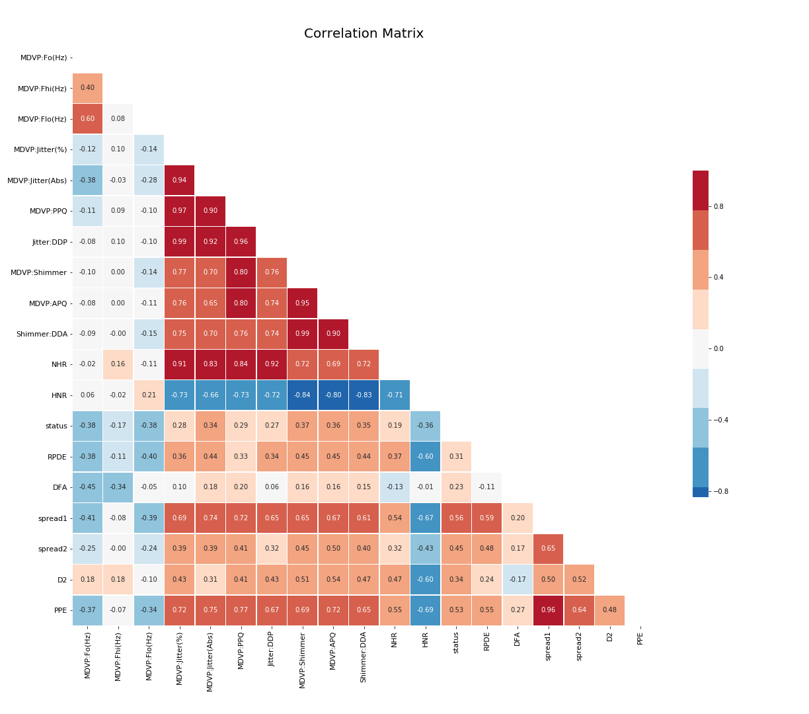
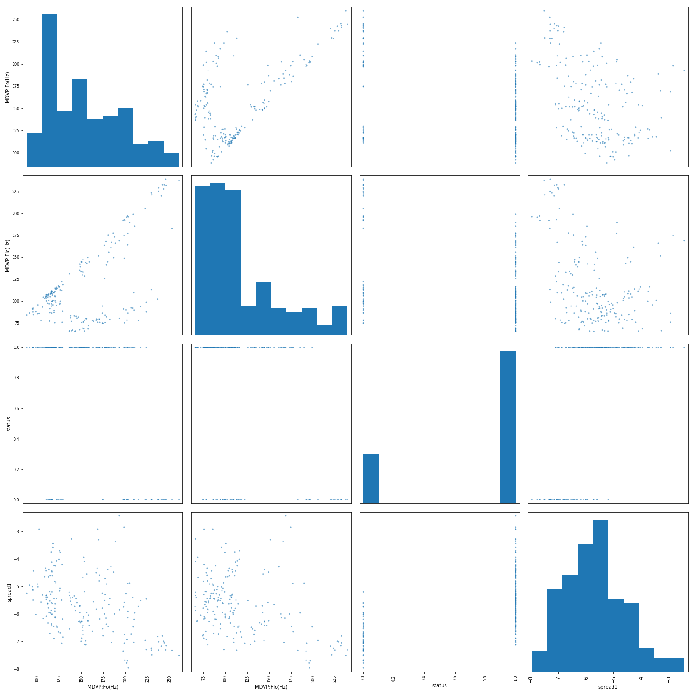
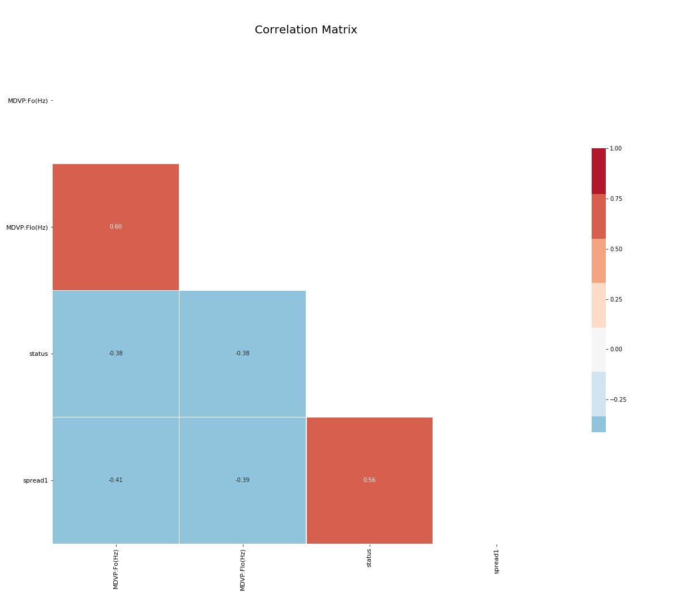
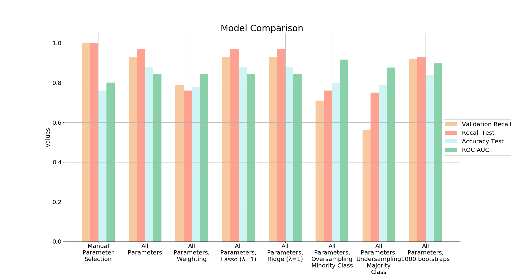
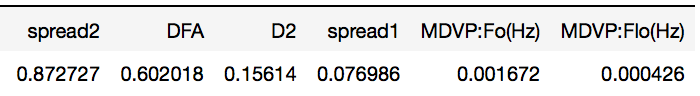

# Detecting Parkinson's using Multidimensional Voice Program Analysis parameters

Multidimensional Voice Program Analysis (MDVP) is an advanced system which allows for the measurement of 33 quantitative voice parameters. 195 MDVP analysis data records were used to build a model capable of detecting vocal attributes possibly linked with tremors associated with Parkinson's Disease. From these 195 recordings, supplied by 31 people. 23 had Parkinson's and 8 people did not. Of the 33 parameters MDVP extrapolates, 22 were supplied in the dataset.

## Question
Is it possible to detect whether someone has Parkinson's Disease from MDVP parameters?

## Hypothesis

> *H0: μ1 =  μ2* 
>*H0:* There is no discernible difference between the speech frequencies, vocal jitter, or other parameters between a person with Parkinson's Disease and one that does not. Therefore, it will not be possible to create a model to predict if someone has Parkinson's.

　

>*H1: μ1 ≠  μ2* 
> *H1:* There is a difference between the speech frequencies and parameters between people with Parkinson's disease and those that do not and therefore, a model will be able to predict, with better accuracy than random guessing, whether or not someone has Parkinson's Disease.

## Exploratory Data Analysis & Data Cleaning

Looking at the correlation heatmap each of the 22 parameters has a fairly decent correlation with status (whether the recording was from someone with Parkinson's or from someone without Parkinson's). The highest correlations between the parameters and status being spread1 and spread2 with a positive 0.56 and 0.45 correlation, respectively. PPE has a positive correlation 0.53. MDVP.Fo(Hz), MDVP.Flo(Hz), and HNR have negative correlations of -0.38, -0.38 and -0.36. These will be the parameters I look at first when modeling, however with most of the other parameters having at least a 0.15 correlation, it may be difficult to fit with only 5 parameters when all the others are correlated. I will have to look to see if any parameters appear to be correlated between each other as well to help determine which parameters may be correliant on another parameter.

Additionally, looking at the heatmap, the following parameters have correlations with eachother above 0.90 and therefore may be **colinear**:

**MDVP:Jitter(%)**
- MDVP:Jitter(Abs) & MDVP:Jitter(%) (0.94)
- MDVP:RAP & MDVP:Jitter(%) (**0.99**)
- MDVP:PPQ & MDVP:Jitter(%) (0.97)
- Jitter:DDP & MDVP:Jitter(%) (**0.99**)
- NHR & MDVP:Jitter(%) (0.91)

**MDVP:Jitter(Abs)**
- MDVP:RAP & MDVP:Jitter(Abs) (0.92)
- MDVP:PPQ & MDVP:Jitter(Abs) (0.90)
- Jitter:DDP & MDVP:Jitter(Abs) (0.92)

**MDVP:RAP**
- MDVP:PPQ & MDVP:RAP (0.96)
- Jitter:DDP & MDVP:RAP (**1.0**)
- NHR & MDVP:RAP (0.92)

**Jitter:DDP**
- MDVP:PPQ & Jitter:DDP (0.96)
- NHR & Jitter:DDP (0.92)

**MDVP:RAP**
- Jitter:DDP & MDVP:PPQ (0.96)

**MDVP:Shimmer**
- MDVP:Shimmer(dB) & MDVP:Shimmer (**0.99**)
- Shimmer:APQ3 & MDVP:Shimmer (**0.99**)
- Shimmer:APQ5 & MDVP:Shimmer (**0.98**)
- MDVP:APQ & MDVP:Shimmer (0.95)
- Shimmer:DDA & MDVP:Shimmer (**0.99**)

**MDVP:Shimmer(dB)**
- Shimmer:APQ3 & MDVP:Shimmer(dB) (0.96)
- Shimmer:APQ5 & MDVP:Shimmer(dB) (0.96)
- MDVP:APQ & MDVP:Shimmer(dB) (0.97)
- Shimmer:DDA & MDVP:Shimmer(dB) (0.96)

**Shimmer:APQ3**
- Shimmer:APQ5 & Shimmer:APQ3 (0.96)
- MDVP:APQ & Shimmer:APQ3 (0.90)
- Shimmer:DDA & Shimmer:APQ3 (**1.0**)

**Shimmer:APQ5**
- MDVP:APQ & Shimmer:APQ5 (0.95)
- Shimmer:DDA & Shimmer:APQ5 (0.96)

**MDVP:APQ**
- Shimmer:DDA & MDVP:APQ (0.90)

**Spread1**
- PPE & Spread1 (0.96)

During exploration, many of the parameters were colinear and I decided to drop the following parameters and do a secondary correlation heatmap:
1. Shimmer:APQ3
2. Shimmer:APQ5
3. MDVP:RAP
4. MDVP:Shimmer(dB)

---

After the second heatmap, I chose to do logistic regression models on the following parameters trying to predict a person's status (whether they have Parkinson's Disease or not):
- MDVP:Fo(Hz)
- MDVP:Flo(Hz)
- spread1

A model was created via Logistic Regression and several types of data manipulation on both the parameters I selected above as well as the whole dataset (with all parameters) to try to present the best model for predicting whether a person has Parkinson's Disease.

I created a scattermatrix to visualize the distributions between the parameters.

Many of the parameters are transformations of other parameters therefore I manually selected 3 parameters to test a logistic regression model. This model was then compared to one with all parameters and using Lasso Regularization, the coefficients utilized and their importance in the model prediction equation was used to determine which parameters were instrumental in predicting whether someone had Parkinson's.

## Model Methodology
This was an exploratory analysis in the best method to create a model that limits false negative results. Recall was used to determine the fidelity the model represented in correctly detecting if someone did indeed have Parkinson's Disease.

 \(Recall = \frac{Number of correct positive diagnoses}{(Number of correct positive diagnoses)+(Number of incorrect negative diagnoses)}\))

As a result, precision, depending on number of incorrect false positive results, was not investigated. With regards to why recall was investigated and not precision, in medicine, minimizing the number of diagnoses missed (false negatives) if imperative while number of preemeptive diagnoses (false positives) is not.

Multiple methods were sampled and visualized below to determine which resulted in the highest recall for the test data (data never before seen by the model) in conjunction with the highest accuracy (indicating that there isn't a tradeoff of less false negatives for more false positives).

## Model

From the tested models, the model with the least number of false negatives (missed Parkinson's detection) while maintaining the highest level of accuracy appeared to be a normal stratified, non-weighted, non-bootstrapped, non-sample biased (undersampled vs oversampled), logistic regression plot. With this model there are still false negatives when predicting with the original test dataset. Adjusting the threshold could remedy this and produce a model that has a higher recall.

---

The coefficients determined to be predictive of Parkinson's Disease based upon MDVP parameters being the following:

